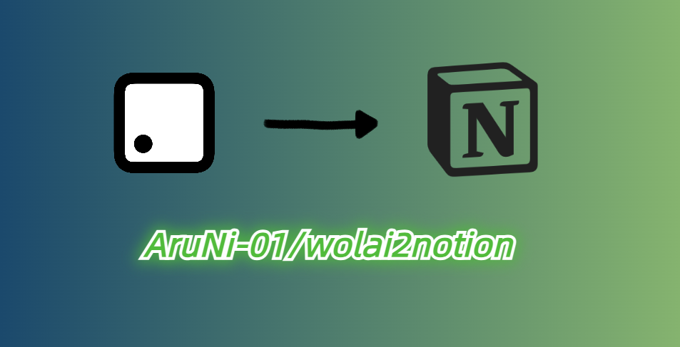

<h1 align="center">
  <br>
  
  <br>
  <b>Wolai Convert To Notion</b>
  <br>
</h1>
<p align="center">
  一款 Wolai 转到 Notion 的 Python 小工具，支持大多数类型的 Block，以及 Database、Page 的转换
</p>

## 🎬 Demo

Database Convert Demo:


ps: 转换失败的 row 是由 [Wolai API 调用频率限制](https://github.com/AruNi-01/wolai2notion#wolai-api-%E8%B0%83%E7%94%A8%E9%A2%91%E7%8E%87%E9%99%90%E5%88%B6) 导致。

## 📖 Introduction

由于 Wolai 被钉钉收购后，并未支持 Wolai 与钉钉的同步，而且官方对 Wolai 的更新频率大大降低，所以还是决定把 Wolai 的数据转移到 Notion 里。

Wolai 是直接使用官方提供的 [API](https://www.wolai.com/wolai/7FB9PLeqZ1ni9FfD11WuUi)，因为 Notion 有第三方 SDK，所以使用的是开源的 [notion-sdk-py](https://github.com/ramnes/notion-sdk-py)

## ✨ Features
- [x] Wolai Database Row(Page) 的转换
  - [x] 并发转换，提高 rows 过多时的转换速度，但 log 和 csv 会混乱
- [x] image/file 上传至 oss，然后替换 url（[Notion API 暂时不支持上传 file 到 Notion](https://developers.notion.com/reference/file-object)）
- [x] 纯 Page 的导入
- [ ] [Wolai 行内引用、嵌入引用、页面引用](https://www.wolai.com/wolai/i1eTuzCbCDV4ymqaDPRN5w)（理论上可以用 Notion 的 Sync Block 和 Link To Page 实现，但无法保证原 Block 一定比该引用先创建，因此暂且搁置。目前只是简单的填充 Block 内容，不做关联）

支持的 Block、Block 内的 Content 类型（[Wolai Block Type](https://www.wolai.com/wolai/uKwoVabBPqLniFDN6BgRN9)｜[Notion Block Type](https://developers.notion.com/reference/block#block-type-objects)）：

```python
# Block Type
class BlockType:
    HEADING = 'heading'     # 标题，包括是否可折叠
    ENUM_LIST = 'enum_list'     # 有序列表
    BULL_LIST = 'bull_list'     # 无序列表
    TOGGLE_LIST = 'toggle_list'     # 折叠列表
    CODE = 'code'       # 代码块
    IMAGE = 'image'     # 图片
    VIDEO = 'video'     # 视频
    QUOTE = 'quote'     # 引用 (markdown 中的 >)
    TEXT = 'text'       # 文本
    BOOKMARK = 'bookmark'   # 书签
    DIVIDER = 'divider'     # 分割线
    TABLE = 'table'  # 表格
    CALLOUT = 'callout'       # 标注框
    BLOCK_EQUATION = 'block_equation'   # 公式
    REFERENCE = 'reference'     # 引用


# 整个大 Block 的内容中，每个 content 的类型，支持外链 link
class BlockContentType:
    BOLD = 'bold'       # 加粗文本
    INLINE_CODE = 'inline_code'     # 行内代码
    TEXT = 'text'       # 普通文本
```

## 🗳️ Database Row(Page) Convert

Database 的 property 可以直接导出为 csv，然后 import 进 Notion，row 中的内容可以使用本工具转换。

### Usage

1. 下载依赖（需要 Python 3.11）：
    ```shell
    pip install -r requirements.txt
    ```
2. 填写配置文件 `conf/conf.yml`，`copy conf.yml.bak conf.yml`（`conf.yml` 不会 Push 到 Git 仓库），再进行填写：
    ```yml
   wolai:
     base_info:
       app_id: xxxxxxx
       app_secret: xxxxxxxxxxx
   
     database_info:
       database_id: t8FRZDBoFmrprSZmRYywzd
   
   
   notion:
     base_info:
       secrets: xxxxxxxxxxxx
   
     database_info:
       database_id: 3db93a181d91470e852db20a04a2f1da
   
   # 若需要上传图片到 oss
   oss:
     base_info:
       access_key_id: xxxxxx
       access_key_secret: xxxxxxx
       endpoint: oss-cn-beijing.aliyuncs.com
       bucket_name: run-notion
   
     upload_info:
       # 上传到 oss bucket 的文件夹（例如 abc/efg），不包含 Bucket 名称和具体的文件名（例如 abc.jpg）。
       oss_file_path: from_wolai_img
    ```
   `base_info` 中的信息可以查看 [App 开发者中心](https://aarynlu.notion.site/aarynlu/App-34980aba84f048788b735f969742bdaa) 中对应的 API 文档；`database_info` 中的 `database_id` 可以在对应 Database 中的链接中找到（如果是把 database 嵌入一个页面的话，注意是 database_id，而不是 page_id）。
3. 运行：
    ```shell
    python3 ./run/convert_database_row.py
    ```
    若是在终端而非 IDE 运行，可能会出现 ModuleNotFoundError，解决方法在 [Questions](https://github.com/AruNi-01/wolai2notion#modulenotfounderror-no-module-named-xxx)。
4. 运行时，会先填入需要转换的起始和结束的 idx，这个 idx 是 database 所有 row 经过 title 排序后数组的 idx，所以运行前最好先去 test 文件中看看 database rows 的 title 排序，然后填入对应的 idx。
   示例：
   ```text
   请输入从第几行(包括) database_row 开始转换 (min 0): 0
   请输入到第几行(包括) database_row 结束转换 (max 385): 5
   转换区间为 [0, 5]，总计 6 个，从【# 1004. 最大连续1的个数 III】开始, 到【#1005 K 次取反后最大化的数组和】结束
   ```
5. 运行结束后，会在 `csv_result` 文件夹中生成对应的 csv 文件，可以查看转换的结果和进度信息。

## 📑 Page Import

由于 Notion API 提供的 Create Page 接口必须要选定一个 Page 或者 Database 作为 parent（或许是我没找到直接创建新 Page 的接口），所以需要先在 Notion 新建一个页面（别忘了将 Integration 添加到该页面的 Connections 中），然后需要导入的 Wolai Page 都会导入到这个 parent 页面下，导入完成后再手动移动到 Workspace 下即可。
   
### Usage

基本步骤和上面差不多，主要是配置文件，需要填入 Notion 新建的 Parent Page ID，以及 wolai 中需要导入的 page_id：

```yaml
wolai:
  base_info:
    app_id: xxxxxxx
    app_secret: xxxxxxxxxxx

  database_info:
    database_id: t8FRZDBoFmrprSZmRYywzd

  page_info:
    parent_page_id: bc9911bac275450f965f8a4e69a60be1  # 注意：这里是 Notion 的 Parent Page ID
    page_ids:
      - gos2xG43iKy2LsRaopYmTZ
      - xmcQthUywjfNhnEqbjAWDN
```

然后运行：

```shell
python3 ./run/import_page.py
```

## 🙋 Questions

### Wolai API 调用频率限制

错误信息：ValueError: Request failed with status code:429

原因：[Wolai API 调用频率限制](https://www.wolai.com/wolai/8vB1m96e4QYiRzjStcaen5)，每小时只能调用 500 次，每月只能调用 10000 次（个人专业版）

```json
{
    "message": "API调用频率过高, 请稍后再试。每小时只能调用500次",
    "error_code": 17007,
    "status_code": 429
}
```

### ModuleNotFoundError: No module named 'xxx'

错误信息：
```shell
➜  wolai2notion git:(master) ✗ python3 ./run/convert_database_row.py
Traceback (most recent call last):
  File "/root/python/wolai2notion/./run/convert_database_row.py", line 3, in <module>
    from block_convert.wolai_block import WolaiBlockType
ModuleNotFoundError: No module named 'block_convert'
```

原因：在终端运行时，Python 解释器默认不会去寻找项目根目录下的 module，所以导致找不到自定义 module

解决办法有两种：

- 在待运行的 python 文件中添加项目根目录到系统 path 中：
  ```python
  import sys
  sys.path.append('/home/python/project')
  ```
- 添加环境变量：
  ```shell
  export PYTHONPATH=$PYTHONPATH:/home/python/project
  ```
  > 若是 win，可以直接到环境变量中，将项目地址添加到 PYTHONPATH 中。

### code.rich_text[0].text.content.length should be ≤ `2000`, instead was `xxxx`

原因：Notion 中，code block 的 content 长度最大只能是 2000

解决办法：手动复制

### [WinError 10054] 远程主机强迫关闭了一个现有的连接。

原因：抓取信息太过频繁，引起远程主机的怀疑，被网站怀疑是恶意攻击行为。

解决办法：确认网络稳定的情况下，进行重试。
